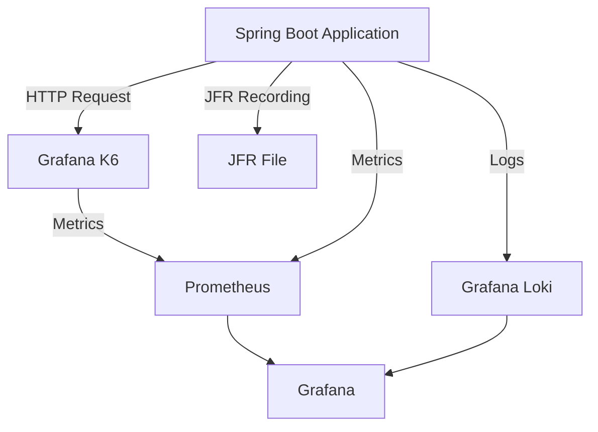

# springboot-performance-lab
A laboratory environment for practicing performance tuning, monitoring, and analysis of Spring Boot applications using Prometheus, Grafana, K6, and JFR.

## command 

### 1. Spin up Infrastructure
Create and start the containers (Database, Monitoring stack, and Load Testing tools):
```shell
docker-compose -p pref -f loadtest-compose.yml -f monitoring-compose.yml -f postgress-compose.yml up -d
```

### 2. Run Load Test
Execute a k6 load test script and export metrics to Prometheus:
```shell
docker exec -it pref_k6 k6 run --out experimental-prometheus-rw=http://prometheus:9090/api/v1/write /scripts/loadTestK6.js
```

### 3. Stop Services
Stop and remove the containers:
```shell
docker-compose -p pref -f loadtest-compose.yml -f monitoring-compose.yml -f postgress-compose.yml down
```

## Architecture Flow
The system architecture follows this data flow:


## Monitoring & Tools
### Access Links (Localhost)
- **Prometheus:** `http://localhost:9090`
- **Grafana:** `http://localhost:3000`

## Recommended Dashboards
[Dashboard spring boot](https://grafana.com/grafana/dashboards/17053-spring-boot-statistics-endpoint-metrics/)

[Dashboard K6 Grafana](https://grafana.com/grafana/dashboards/19665-k6-prometheus/)

[Document K6 Prometheus](https://grafana.com/docs/k6/latest/results-output/real-time/prometheus-remote-write/)

## Performance Analysis (JFR)
**Java Flight Recorder (JFR)** is used for deep-dive analysis of JVM behavior.
### Start JFR Recording
Add these flags to your JVM startup command (choose the one that fits your use case):
```text
# For a fixed duration
-XX:StartFlightRecording=duration=60s,filename=PerformanceRecording.jfr
# For a maximum file size
-XX:StartFlightRecording=filename=PerformanceRecording.jfr,maxsize=200m
# For rotating files (Recommended for longer runs)
-XX:StartFlightRecording=filename=PerformanceRecording.jfr,maxage=1h
```

## JFR Command Line Tools
### Show JFR summary
```bash
jfr summary recording.jfr
```

### Analysis Tools
- **JFR Summary:** Use `jfr summary recording.jfr` to see a quick overview.
- **JMC (Java Mission Control):** [Download JMC](https://www.oracle.com/java/technologies/javase/products.html) to visualize CPU, Memory, GC, and Threads in real-time from `.jfr` files.
