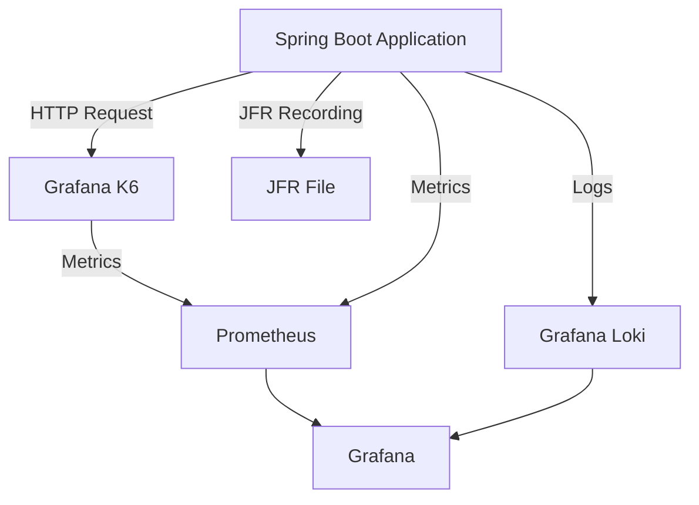

# springboot-performance-lab

## command 

#### 1. Create container 
```shell
docker-compose -p pref -f loadtest-compose.yml -f monitoring-compose.yml -f postgress-compose.yml up -d
```

#### 2. Down container 
```shell
docker-compose -p pref -f loadtest-compose.yml -f monitoring-compose.yml -f postgress-compose.yml down
```

#### 3. Run scrip load test 
```shell
docker exec -it pref_k6 k6 run --out experimental-prometheus-rw=http://prometheus:9090/api/v1/write /scripts/loadTestK6.js
```

## Flowchart application


## prometheus
```text
localhost:9090
```

## grafana
```text
localhost:3000
```

## Dashboard
[Dashboard spring boot](https://grafana.com/grafana/dashboards/17053-spring-boot-statistics-endpoint-metrics/)

[Dashboard K6 Grafana](https://grafana.com/grafana/dashboards/19665-k6-prometheus/)

[Document K6 Prometheus](https://grafana.com/docs/k6/latest/results-output/real-time/prometheus-remote-write/)

## JFR (Java Flight Recorder)
```shell
jfr summary recording.jfr
```
command JCMD
command jconsole


## JMC (Java Mission Control)
#### open jfr file